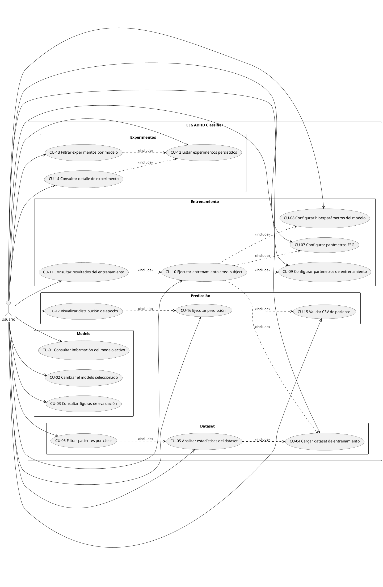

# Apéndice B — Especificación de Requisitos

## B.1. Introducción

Este anexo define los **requisitos del software entregado** al usuario final
del proyecto **EEG ADHD Classifier**, una aplicación web académica para la
clasificación binaria de señales EEG en dos clases (ADHD / Control) mediante
modelos de Machine Learning clásico y Deep Learning.

> **Alcance.** Los requisitos descritos en este apéndice se refieren al
> software entregado: API FastAPI + SPA React + base de datos PostgreSQL.
> Los scripts contenidos en `scripts/` (entrenamiento offline, exportación
> del modelo final, importancia de features) forman parte del **proceso de
> investigación** que produce el modelo exportado y, conforme a la guía
> oficial de TFG de la UBU, **no se modelan como casos de uso del software
> entregado**.

El sistema tiene carácter **académico y de demostración**; no debe utilizarse
como herramienta de diagnóstico clínico.

### Actores

| Actor       | Descripción                                                                                                                                          |
|-------------|------------------------------------------------------------------------------------------------------------------------------------------------------|
| **Usuario** | Único rol del sistema. Investigador o estudiante que interactúa con la SPA a través del navegador. No requiere autenticación: el acceso es directo. |

---

## B.2. Objetivos generales

El sistema persigue los siguientes objetivos generales:

1. **Permitir al usuario explorar un dataset EEG** cargando un CSV con datos
   multipaciente y obtener estadísticas exploratorias.
2. **Permitir entrenar modelos de clasificación** ADHD / Control de forma
   interactiva, configurando parámetros de procesado EEG, modelo y
   entrenamiento.
3. **Permitir predecir la clase de un paciente nuevo** a partir de su CSV,
   utilizando un modelo previamente exportado.
4. **Comparar modelos de Machine Learning clásico frente a Deep Learning**
   ofreciendo cinco modelos ML (Logistic Regression, RBF SVC, KNN, Random
   Forest, XGBoost) y tres modelos DL (CNN 1D, CNN-LSTM, EEGNet).
5. **Garantizar la validez metodológica** de los resultados aplicando
   validación cruzada *cross-subject* (`StratifiedGroupKFold`) que impide
   la fuga de información entre pacientes.
6. **Mantener un histórico reproducible de los experimentos** lanzados
   desde la aplicación, almacenando para cada uno los parámetros utilizados,
   el dataset asociado y las métricas obtenidas, de modo que sus resultados
   sean trazables y comparables.

---

## B.3. Catálogo de requisitos

### B.3.1. Requisitos funcionales (RF)

| ID    | Descripción                                                                                                                                                                       |
|-------|-----------------------------------------------------------------------------------------------------------------------------------------------------------------------------------|
| RF-01 | El sistema permite cargar archivos CSV con datos EEG multipaciente.                                                                                                                |
| RF-02 | El sistema valida el formato del CSV (cabeceras, canales esperados, columna `ID` de sujeto y columna `Class`).                                                                     |
| RF-03 | El sistema calcula y muestra estadísticas del dataset cargado (filas, columnas, número de pacientes únicos, distribución de clases, canales EEG detectados).                       |
| RF-04 | El sistema permite filtrar la lista de pacientes mostrada por clase (ADHD / Control).                                                                                              |
| RF-05 | El sistema ofrece un catálogo de cinco modelos ML clásicos: Logistic Regression, RBF SVC, KNN, Random Forest y XGBoost.                                                            |
| RF-06 | El sistema ofrece un catálogo de tres modelos de Deep Learning: CNN 1D, CNN-LSTM y EEGNet.                                                                                          |
| RF-07 | El sistema permite configurar parámetros de procesado EEG: longitud de ventana (epoch), solape, frecuencia de muestreo y bandas de frecuencia (delta, theta, alpha, beta, gamma).  |
| RF-08 | El sistema permite configurar hiperparámetros específicos del modelo seleccionado.                                                                                                 |
| RF-09 | El sistema permite configurar parámetros generales del entrenamiento (número de folds del CV, tamaño de batch, número de épocas para DL, etc.).                                    |
| RF-10 | El sistema ejecuta validación cruzada *cross-subject* usando `StratifiedGroupKFold`, garantizando que ningún paciente aparece simultáneamente en entrenamiento y test.              |
| RF-11 | El sistema bloquea la navegación entre pestañas y avisa al usuario si intenta recargar la página mientras un entrenamiento está en curso.                                          |
| RF-12 | Al finalizar un entrenamiento, el sistema muestra las métricas agregadas y por fold (accuracy, balanced accuracy, precision, recall, F1, matriz de confusión).                     |
| RF-13 | El sistema permite consultar la información del modelo actualmente exportado: tipo, hiperparámetros y métricas de validación.                                                      |
| RF-14 | El sistema muestra las figuras de evaluación del modelo exportado (matriz de confusión, curva ROC, curvas de entrenamiento DL, importancia de features cuando aplica).             |
| RF-15 | El sistema permite seleccionar entre el mejor modelo ML exportado (`ml_best`) y el mejor modelo DL exportado (`dl_best`).                                                          |
| RF-16 | El sistema valida un CSV de paciente individual antes de ejecutar la predicción, comprobando compatibilidad con el modelo seleccionado.                                            |
| RF-17 | El sistema predice la clase (ADHD / Control) de un paciente nuevo a partir de su CSV, devolviendo la decisión final y el score asociado.                                           |
| RF-18 | El sistema muestra la distribución de epochs predichas por clase para el paciente analizado.                                                                                       |
| RF-19 | El sistema persiste cada entrenamiento ejecutado en la base de datos, registrando dataset asociado, modelo, parámetros utilizados y métricas obtenidas (agregadas y por fold).      |
| RF-20 | El sistema deduplica los datasets persistidos mediante un *hash* SHA-256 del contenido, evitando duplicar metadatos cuando el mismo CSV se utiliza en varios experimentos.          |
| RF-21 | El sistema permite consultar el listado paginado de experimentos persistidos, con filtros opcionales por tipo de modelo (ML / DL) y nombre de modelo.                              |
| RF-22 | El sistema permite consultar el detalle completo de un experimento concreto, incluyendo todos sus parámetros, métricas, matriz de confusión y resultados por fold.                  |

### B.3.2. Requisitos no funcionales (RNF)

| ID     | Categoría             | Descripción                                                                                                                                                |
|--------|-----------------------|------------------------------------------------------------------------------------------------------------------------------------------------------------|
| RNF-01 | Disponibilidad        | La aplicación se despliega de forma reproducible mediante Docker Compose con servicios para backend, frontend y PostgreSQL.                                |
| RNF-02 | Portabilidad          | La aplicación funciona en Windows, Linux y macOS gracias a la contenerización con Docker.                                                                  |
| RNF-03 | Mantenibilidad        | El código Python sigue PEP 8, validado automáticamente con `ruff`. El código JavaScript sigue las reglas de ESLint.                                         |
| RNF-04 | Calidad               | El proyecto se evalúa con SonarCloud y mantiene el Quality Gate en estado verde.                                                                            |
| RNF-05 | Pruebas               | El backend dispone de tests automatizados con `pytest`, organizados en tests unitarios y de integración. La cobertura se reporta a SonarCloud.              |
| RNF-06 | Integración continua  | Cada push y pull request sobre `main` lanza un pipeline de GitHub Actions con lint, tests y análisis estático.                                              |
| RNF-07 | Rigor metodológico    | La validación de modelos se realiza siempre *cross-subject* mediante `StratifiedGroupKFold` para evitar fuga de información entre pacientes.                |
| RNF-08 | Trazabilidad          | Cada experimento ejecutado queda registrado en la base de datos con suficientes metadatos para reproducir el entrenamiento y comparar resultados.           |
| RNF-09 | Documentación         | El sistema dispone de README, manual de usuario y manual del programador (en anexos), y documentación interna de funciones públicas mediante docstrings.    |
| RNF-10 | Usabilidad            | La interfaz se organiza en cinco pestañas (Modelo, Dataset, Entrenamiento, Experimentos, Predicción) con un flujo guiado de izquierda a derecha.            |
| RNF-11 | Robustez              | Los endpoints validan los datos de entrada con Pydantic y devuelven códigos HTTP semánticos: 400 (validación), 404 (no encontrado), 500 (error interno).    |
| RNF-12 | Licencia              | El sistema se distribuye bajo licencia MIT, compatible con todas sus 30 dependencias directas (ver `docs/licencias.md`).                                    |
| RNF-13 | Persistencia          | El histórico de experimentos se almacena en PostgreSQL 16 mediante SQLAlchemy 2.0 con migraciones gestionadas por Alembic.                                   |
| RNF-14 | Seguridad             | El contenedor del backend ejecuta los procesos con un usuario sin privilegios. Las credenciales de la base de datos se inyectan vía variables de entorno.   |

---

## B.4. Especificación de requisitos

Esta sección detalla los casos de uso del sistema en notación UML y describe
cada uno de ellos mediante una tabla.

### B.4.1. Diagrama general de casos de uso

> El fichero PlantUML puede renderizarse con la extensión "PlantUML" de
> VS Code, mediante PlantUML Server (`https://www.plantuml.com/plantuml`),
> o por línea de comandos con `plantuml`.

### B.4.2. Tablas de casos de uso

#### CU-01 — Consultar información del modelo activo

| Campo             | Contenido                                                                                                                                          |
|-------------------|----------------------------------------------------------------------------------------------------------------------------------------------------|
| Actor             | Usuario                                                                                                                                            |
| Descripción       | El usuario consulta el tipo, hiperparámetros y métricas del modelo actualmente exportado.                                                          |
| Precondición      | Existe al menos un modelo exportado en el sistema.                                                                                                 |
| Flujo principal   | 1. El usuario accede a la pestaña "Modelo". 2. El sistema solicita `GET /model/info` y `GET /model/figures`. 3. El sistema muestra metadatos y métricas. |
| Postcondición     | El usuario dispone de la información detallada del modelo activo.                                                                                  |
| Excepciones       | E1: No hay modelo exportado → el sistema muestra un aviso informativo.                                                                             |
| RF relacionados   | RF-13                                                                                                                                              |

#### CU-02 — Cambiar el modelo seleccionado

| Campo             | Contenido                                                                                                                                          |
|-------------------|----------------------------------------------------------------------------------------------------------------------------------------------------|
| Actor             | Usuario                                                                                                                                            |
| Descripción       | El usuario cambia entre el mejor modelo ML (`ml_best`) y el mejor modelo DL (`dl_best`).                                                           |
| Precondición      | Existen ambos modelos exportados.                                                                                                                  |
| Flujo principal   | 1. El usuario abre el selector de modelo. 2. Elige una opción del listado (`GET /models`). 3. El sistema recarga la información del modelo elegido. |
| Postcondición     | El modelo seleccionado se aplica a las predicciones posteriores.                                                                                   |
| Excepciones       | E1: El modelo seleccionado no existe → error 404 con mensaje al usuario.                                                                           |
| RF relacionados   | RF-15                                                                                                                                              |

#### CU-03 — Consultar figuras de evaluación del modelo

| Campo             | Contenido                                                                                                                                          |
|-------------------|----------------------------------------------------------------------------------------------------------------------------------------------------|
| Actor             | Usuario                                                                                                                                            |
| Descripción       | El usuario visualiza las figuras generadas durante la evaluación del modelo (matriz de confusión, ROC, curvas de entrenamiento, importancia).      |
| Precondición      | El modelo seleccionado tiene figuras asociadas exportadas.                                                                                         |
| Flujo principal   | 1. El sistema recupera la lista de figuras vía `GET /model/figures`. 2. El frontend las renderiza embebidas.                                       |
| Postcondición     | El usuario observa las figuras de evaluación.                                                                                                      |
| Excepciones       | E1: No hay figuras asociadas → se muestra un mensaje vacío.                                                                                        |
| RF relacionados   | RF-14                                                                                                                                              |

#### CU-04 — Cargar dataset de entrenamiento

| Campo             | Contenido                                                                                                                                          |
|-------------------|----------------------------------------------------------------------------------------------------------------------------------------------------|
| Actor             | Usuario                                                                                                                                            |
| Descripción       | El usuario sube un CSV con datos EEG multipaciente para usarlo como dataset de entrenamiento.                                                      |
| Precondición      | El usuario dispone de un CSV en el formato esperado.                                                                                               |
| Flujo principal   | 1. El usuario selecciona un archivo en la pestaña "Dataset entrenamiento". 2. El frontend lo retiene en memoria para procesamientos posteriores.   |
| Postcondición     | El archivo queda disponible para análisis y entrenamiento.                                                                                         |
| Excepciones       | E1: Archivo no es CSV → el frontend rechaza la selección.                                                                                          |
| RF relacionados   | RF-01                                                                                                                                              |

#### CU-05 — Analizar estadísticas del dataset

| Campo             | Contenido                                                                                                                                          |
|-------------------|----------------------------------------------------------------------------------------------------------------------------------------------------|
| Actor             | Usuario                                                                                                                                            |
| Descripción       | El usuario solicita el cálculo de estadísticas exploratorias del dataset cargado.                                                                  |
| Precondición      | El usuario ha cargado un CSV (CU-04).                                                                                                              |
| Flujo principal   | 1. El usuario pulsa "Analizar". 2. El frontend envía `POST /training/dataset/stats`. 3. El sistema valida el CSV y devuelve filas, columnas, canales, sujetos únicos y distribución de clases. 4. El frontend renderiza las estadísticas. |
| Postcondición     | El usuario conoce las características del dataset.                                                                                                 |
| Excepciones       | E1: CSV mal formado → 400 con detalle del error.                                                                                                   |
| RF relacionados   | RF-02, RF-03                                                                                                                                       |

#### CU-06 — Filtrar pacientes por clase

| Campo             | Contenido                                                                                                                                          |
|-------------------|----------------------------------------------------------------------------------------------------------------------------------------------------|
| Actor             | Usuario                                                                                                                                            |
| Descripción       | El usuario filtra la lista de pacientes mostrada según la clase asignada.                                                                          |
| Precondición      | Las estadísticas del dataset están cargadas (CU-05).                                                                                               |
| Flujo principal   | 1. El usuario selecciona una clase en el filtro. 2. El frontend recalcula la lista visible.                                                        |
| Postcondición     | La interfaz muestra únicamente pacientes de la clase elegida.                                                                                      |
| RF relacionados   | RF-04                                                                                                                                              |

#### CU-07 — Configurar parámetros EEG

| Campo             | Contenido                                                                                                                                          |
|-------------------|----------------------------------------------------------------------------------------------------------------------------------------------------|
| Actor             | Usuario                                                                                                                                            |
| Descripción       | El usuario ajusta los parámetros de procesado de la señal EEG: longitud de ventana, solape, frecuencia de muestreo y bandas.                       |
| Precondición      | El usuario está en la pestaña "Entrenamiento".                                                                                                     |
| Flujo principal   | 1. El usuario modifica los controles del panel EEG. 2. Los valores quedan en el estado local del frontend hasta el lanzamiento del entrenamiento.  |
| Postcondición     | La configuración EEG queda lista para el entrenamiento.                                                                                            |
| RF relacionados   | RF-07                                                                                                                                              |

#### CU-08 — Configurar hiperparámetros del modelo

| Campo             | Contenido                                                                                                                                          |
|-------------------|----------------------------------------------------------------------------------------------------------------------------------------------------|
| Actor             | Usuario                                                                                                                                            |
| Descripción       | El usuario elige el modelo a entrenar y ajusta sus hiperparámetros específicos.                                                                    |
| Precondición      | El catálogo de modelos está cargado (`GET /model/catalog`).                                                                                        |
| Flujo principal   | 1. El usuario elige tipo (ML o DL) y nombre del modelo. 2. Ajusta los hiperparámetros mostrados en el panel del modelo.                            |
| Postcondición     | La configuración del modelo queda lista para el entrenamiento.                                                                                     |
| RF relacionados   | RF-05, RF-06, RF-08                                                                                                                                |

#### CU-09 — Configurar parámetros de entrenamiento

| Campo             | Contenido                                                                                                                                          |
|-------------------|----------------------------------------------------------------------------------------------------------------------------------------------------|
| Actor             | Usuario                                                                                                                                            |
| Descripción       | El usuario ajusta los parámetros del entrenamiento (folds, batch size, épocas, etc.).                                                              |
| Precondición      | El usuario está en la pestaña "Entrenamiento".                                                                                                     |
| Flujo principal   | 1. El usuario modifica los controles del panel de entrenamiento. 2. Los valores se almacenan en el estado local.                                   |
| Postcondición     | La configuración del entrenamiento queda lista.                                                                                                    |
| RF relacionados   | RF-09                                                                                                                                              |

#### CU-10 — Ejecutar entrenamiento cross-subject

| Campo             | Contenido                                                                                                                                          |
|-------------------|----------------------------------------------------------------------------------------------------------------------------------------------------|
| Actor             | Usuario                                                                                                                                            |
| Descripción       | El usuario lanza un entrenamiento que aplica validación cruzada *cross-subject* sobre el dataset y los parámetros seleccionados.                   |
| Precondición      | Se han realizado los CU-04, CU-07, CU-08 y CU-09.                                                                                                  |
| Flujo principal   | 1. El usuario pulsa "Entrenar". 2. El frontend bloquea la navegación e impide recargas. 3. Envía `POST /training/run`. 4. El sistema ejecuta `StratifiedGroupKFold` y entrena por fold. 5. Persiste el experimento, metadatos del dataset y métricas por fold en BD. 6. Devuelve métricas agregadas y por fold. |
| Postcondición     | El sistema ha generado un resultado de entrenamiento y un registro persistente en BD.                                                              |
| Excepciones       | E1: Parámetros inválidos → 400. E2: Error durante el entrenamiento → 500 con mensaje.                                                              |
| RF relacionados   | RF-10, RF-11, RF-19, RF-20                                                                                                                         |

#### CU-11 — Consultar resultados del entrenamiento

| Campo             | Contenido                                                                                                                                          |
|-------------------|----------------------------------------------------------------------------------------------------------------------------------------------------|
| Actor             | Usuario                                                                                                                                            |
| Descripción       | El usuario revisa las métricas resultantes del entrenamiento ejecutado.                                                                            |
| Precondición      | El entrenamiento (CU-10) ha finalizado correctamente.                                                                                              |
| Flujo principal   | 1. El frontend muestra el panel de resultados con métricas agregadas (accuracy, balanced accuracy, precision, recall, F1, ROC-AUC), matriz de confusión y resultados por fold. |
| Postcondición     | El usuario dispone de la evaluación cuantitativa del modelo entrenado.                                                                             |
| RF relacionados   | RF-12                                                                                                                                              |

#### CU-12 — Listar experimentos persistidos

| Campo             | Contenido                                                                                                                                          |
|-------------------|----------------------------------------------------------------------------------------------------------------------------------------------------|
| Actor             | Usuario                                                                                                                                            |
| Descripción       | El usuario consulta el listado paginado de experimentos almacenados en la base de datos.                                                            |
| Precondición      | El sistema tiene al menos un experimento registrado.                                                                                               |
| Flujo principal   | 1. El usuario accede a la pestaña "Experimentos". 2. El frontend envía `GET /experiments` con paginación (`limit`, `offset`). 3. El sistema devuelve el listado con metadatos resumidos. |
| Postcondición     | El usuario ve la lista de experimentos disponibles.                                                                                                |
| Excepciones       | E1: No hay experimentos registrados → la lista se muestra vacía con un mensaje informativo.                                                        |
| RF relacionados   | RF-21                                                                                                                                              |

#### CU-13 — Filtrar experimentos por modelo

| Campo             | Contenido                                                                                                                                          |
|-------------------|----------------------------------------------------------------------------------------------------------------------------------------------------|
| Actor             | Usuario                                                                                                                                            |
| Descripción       | El usuario filtra el listado de experimentos por tipo de modelo (ML/DL) o por nombre de modelo concreto.                                            |
| Precondición      | Se está consultando el listado de experimentos (CU-12).                                                                                            |
| Flujo principal   | 1. El usuario aplica un filtro. 2. El frontend envía `GET /experiments?model_type=...&model_name=...`. 3. El sistema devuelve el listado filtrado.  |
| Postcondición     | El usuario ve solo los experimentos que coinciden con el filtro.                                                                                   |
| RF relacionados   | RF-21                                                                                                                                              |

#### CU-14 — Consultar detalle de un experimento

| Campo             | Contenido                                                                                                                                          |
|-------------------|----------------------------------------------------------------------------------------------------------------------------------------------------|
| Actor             | Usuario                                                                                                                                            |
| Descripción       | El usuario consulta el detalle completo de un experimento: parámetros, métricas agregadas, matriz de confusión y resultados por fold.              |
| Precondición      | El experimento existe en la base de datos.                                                                                                         |
| Flujo principal   | 1. El usuario selecciona un experimento de la lista. 2. El frontend envía `GET /experiments/{id}`. 3. El sistema devuelve el detalle completo.     |
| Postcondición     | El usuario dispone de toda la información del experimento.                                                                                         |
| Excepciones       | E1: El experimento no existe → 404 con mensaje.                                                                                                    |
| RF relacionados   | RF-22                                                                                                                                              |

#### CU-15 — Validar CSV de paciente

| Campo             | Contenido                                                                                                                                          |
|-------------------|----------------------------------------------------------------------------------------------------------------------------------------------------|
| Actor             | Usuario                                                                                                                                            |
| Descripción       | El usuario sube el CSV de un paciente individual y el sistema valida que es compatible con el modelo seleccionado.                                  |
| Precondición      | Existe un modelo seleccionado (CU-02).                                                                                                             |
| Flujo principal   | 1. El usuario selecciona el archivo en la pestaña "Predicción". 2. El frontend envía `POST /validate` con el archivo y el `model_id`. 3. El sistema verifica cabeceras, canales y dimensiones. 4. Devuelve un objeto `ValidationResponse`. |
| Postcondición     | El usuario sabe si el archivo es apto para predicción.                                                                                             |
| Excepciones       | E1: CSV incompatible con el modelo → 400 con detalle del error.                                                                                    |
| RF relacionados   | RF-16                                                                                                                                              |

#### CU-16 — Ejecutar predicción

| Campo             | Contenido                                                                                                                                          |
|-------------------|----------------------------------------------------------------------------------------------------------------------------------------------------|
| Actor             | Usuario                                                                                                                                            |
| Descripción       | El usuario solicita la predicción de la clase del paciente cuyo CSV ha sido validado.                                                              |
| Precondición      | CU-15 ha finalizado correctamente.                                                                                                                 |
| Flujo principal   | 1. El usuario pulsa "Predecir". 2. El frontend envía `POST /predict` con el archivo y el `model_id`. 3. El sistema epocha la señal, ejecuta el modelo y agrega los votos por epoch. 4. Devuelve la clase final, el score y la distribución de epochs por clase. |
| Postcondición     | El usuario obtiene la clasificación del paciente.                                                                                                  |
| Excepciones       | E1: Error de procesado → 400 con detalle.                                                                                                          |
| RF relacionados   | RF-17                                                                                                                                              |

#### CU-17 — Visualizar distribución de epochs

| Campo             | Contenido                                                                                                                                          |
|-------------------|----------------------------------------------------------------------------------------------------------------------------------------------------|
| Actor             | Usuario                                                                                                                                            |
| Descripción       | El usuario observa gráficamente cuántas ventanas (epochs) del paciente se han clasificado en cada clase, lo que aporta contexto sobre la confianza de la decisión final. |
| Precondición      | CU-16 ha finalizado correctamente.                                                                                                                 |
| Flujo principal   | 1. El frontend recibe `predictionChartData` y lo renderiza con `recharts`.                                                                         |
| Postcondición     | El usuario interpreta el grado de unanimidad de la predicción.                                                                                     |
| RF relacionados   | RF-18                                                                                                                                              |

---

## B.5. Trazabilidad RF ↔ CU

| RF     | Casos de uso que lo realizan |
|--------|-------------------------------|
| RF-01  | CU-04                         |
| RF-02  | CU-05                         |
| RF-03  | CU-05                         |
| RF-04  | CU-06                         |
| RF-05  | CU-08                         |
| RF-06  | CU-08                         |
| RF-07  | CU-07                         |
| RF-08  | CU-08                         |
| RF-09  | CU-09                         |
| RF-10  | CU-10                         |
| RF-11  | CU-10                         |
| RF-12  | CU-11                         |
| RF-13  | CU-01                         |
| RF-14  | CU-03                         |
| RF-15  | CU-02                         |
| RF-16  | CU-15                         |
| RF-17  | CU-16                         |
| RF-18  | CU-17                         |
| RF-19  | CU-10                         |
| RF-20  | CU-10                         |
| RF-21  | CU-12, CU-13                  |
| RF-22  | CU-14                         |
