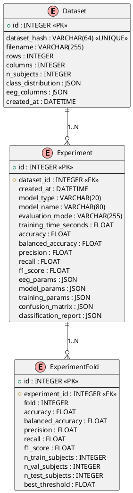
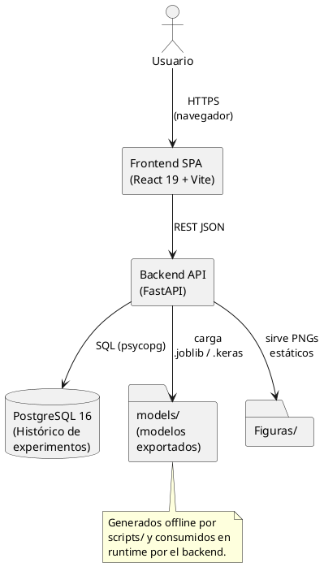
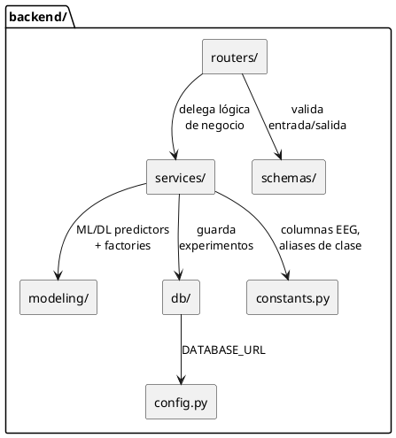
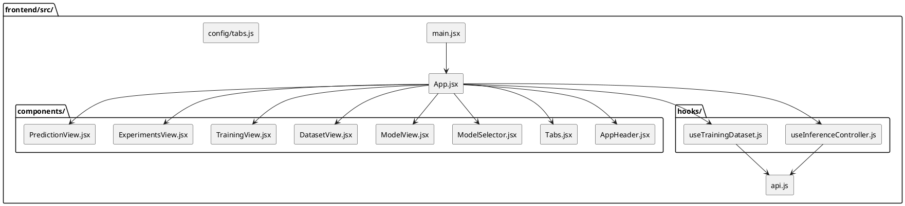
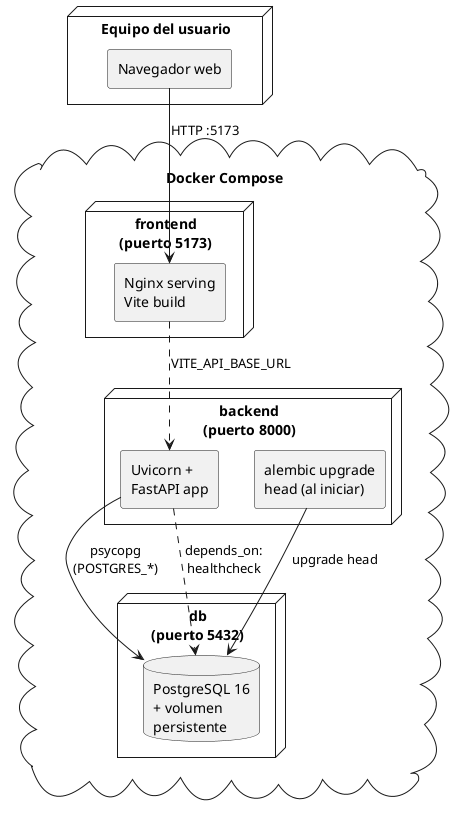
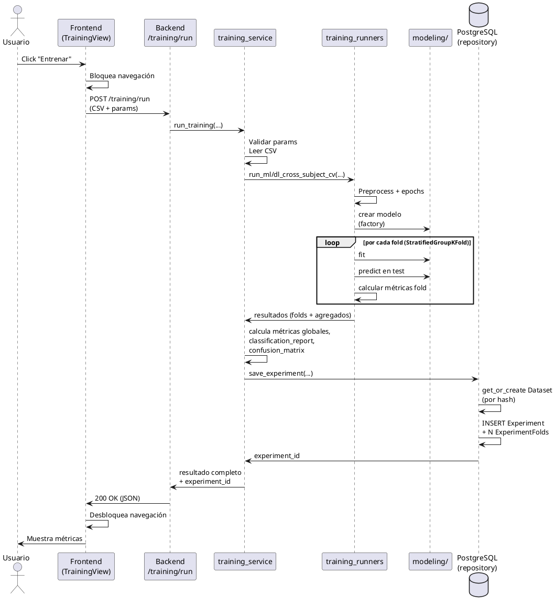
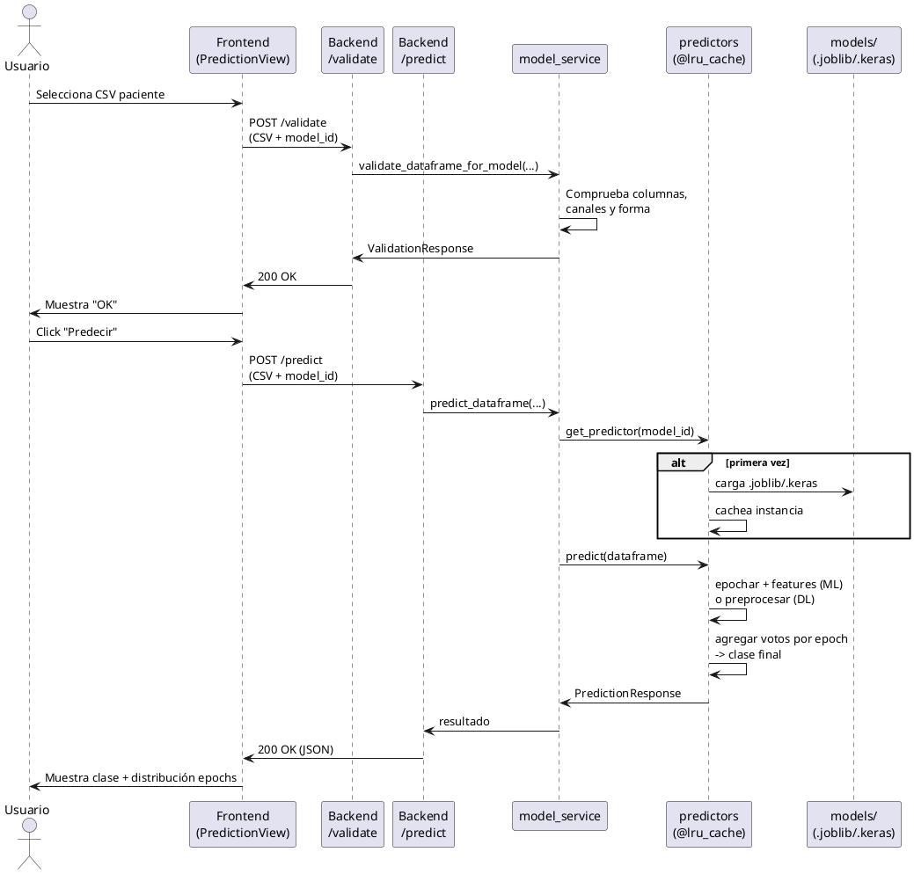
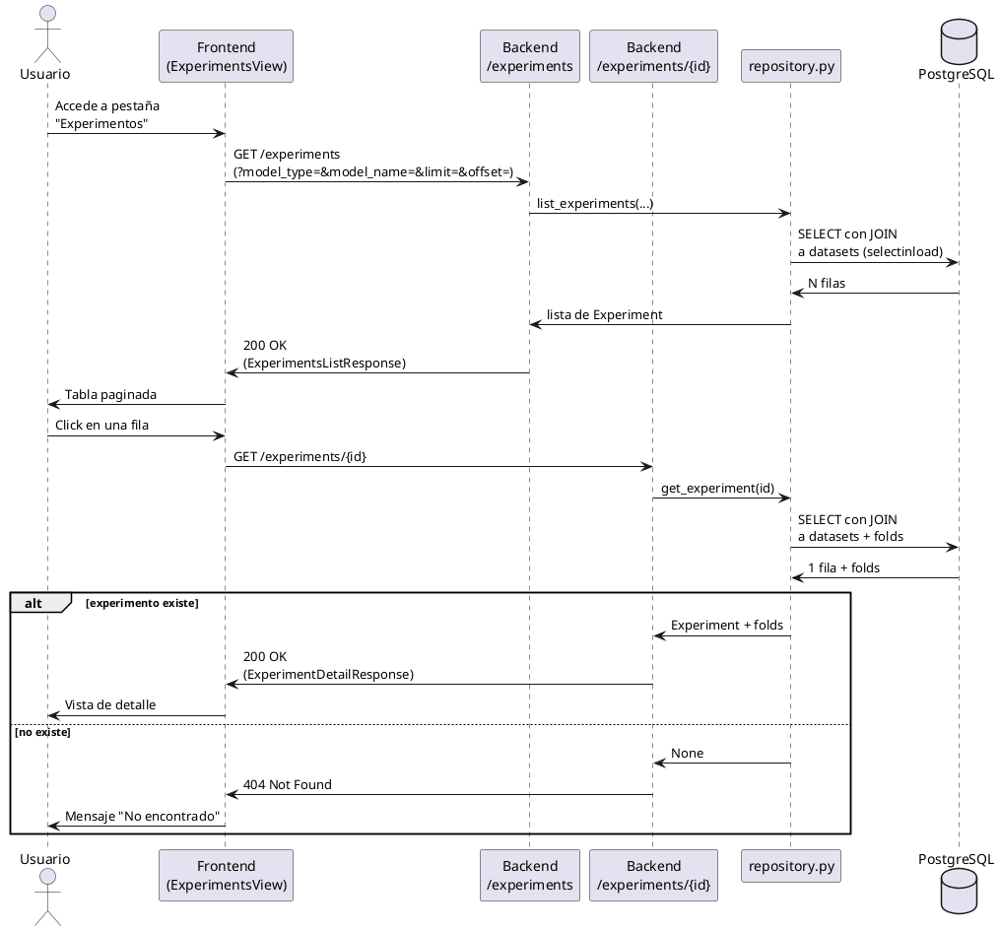

# Apéndice C — Especificación de Diseño

## C.1. Introducción

En este apéndice se documenta el **diseño del sistema entregado** EEG ADHD
Classifier desde tres perspectivas complementarias:

1. **Diseño de datos** (sección C.2): modelo de la base de datos relacional
   utilizada para persistir el histórico de experimentos: diagrama
   entidad-relación, esquema relacional y diccionario de datos.
2. **Diseño arquitectónico** (sección C.3): organización de la aplicación
   en componentes, distribución física en contenedores Docker y decisiones
   arquitectónicas relevantes.
3. **Diseño procedimental** (sección C.4): flujos dinámicos de los casos
   de uso más significativos, representados como diagramas de secuencia
   UML.

El alcance de este apéndice se limita al **software entregado al usuario
final** (API FastAPI + SPA React + base de datos PostgreSQL). Los scripts
de investigación en `scripts/` quedan documentados de forma estructural en
el Apéndice D (Documentación técnica de programación).

Todos los diagramas se incluyen en notación PlantUML por ser un formato
textual versionable en Git; pueden renderizarse a PNG/SVG mediante la
extensión PlantUML de VS Code, el servidor público
<https://www.plantuml.com/plantuml>, o el ejecutable `plantuml` por
línea de comandos.

---

## C.2. Diseño de datos

La aplicación utiliza una **base de datos relacional PostgreSQL 16** para
mantener un histórico reproducible de los experimentos lanzados desde la
interfaz. El esquema persiste los **metadatos de los datasets utilizados**
(no los datos crudos del paciente) y las **métricas de cada entrenamiento
ejecutado**.

### C.2.1. Diagrama Entidad-Relación



**Justificación del modelo:**

- Un **Dataset** representa un CSV de entrada *único*. La unicidad se
  garantiza con el campo `dataset_hash` (SHA-256 del contenido del
  fichero). Esto permite reutilizar la misma fila de `datasets` cuando se
  realizan múltiples experimentos sobre el mismo CSV, evitando duplicación
  de metadatos.
- Un **Experiment** representa un entrenamiento completo de un modelo
  sobre un Dataset. Almacena tanto los parámetros usados (tres
  JSON: `eeg_params`, `model_params`, `training_params`) como las métricas
  globales obtenidas.
- Un **ExperimentFold** representa los resultados de uno de los pliegues
  de la validación cruzada cross-subject. Permite reconstruir la varianza
  por fold y comparar el rendimiento entre pliegues.

### C.2.2. Modelo relacional

A partir del modelo conceptual se obtiene el siguiente modelo relacional,
implementado físicamente en PostgreSQL 16 y gestionado mediante migraciones
de Alembic:

```
datasets (
  id                 INTEGER       PRIMARY KEY AUTOINCREMENT,
  dataset_hash       VARCHAR(64)   NOT NULL UNIQUE,
  filename           VARCHAR(255)  NOT NULL,
  rows               INTEGER       NOT NULL,
  columns            INTEGER       NOT NULL,
  n_subjects         INTEGER       NOT NULL,
  class_distribution JSON          NOT NULL,
  eeg_columns        JSON          NOT NULL,
  created_at         DATETIME      NOT NULL
)
INDEX ix_datasets_dataset_hash ON datasets(dataset_hash)
UNIQUE CONSTRAINT uq_datasets_hash ON datasets(dataset_hash)

experiments (
  id                     INTEGER       PRIMARY KEY AUTOINCREMENT,
  created_at             DATETIME      NOT NULL,
  dataset_id             INTEGER       NOT NULL REFERENCES datasets(id),
  model_type             VARCHAR(20)   NOT NULL,
  model_name             VARCHAR(80)   NOT NULL,
  evaluation_mode        VARCHAR(255)  NOT NULL,
  training_time_seconds  FLOAT         NOT NULL,
  accuracy               FLOAT         NOT NULL,
  balanced_accuracy      FLOAT         NOT NULL,
  precision              FLOAT         NOT NULL,
  recall                 FLOAT         NOT NULL,
  f1_score               FLOAT         NOT NULL,
  eeg_params             JSON          NOT NULL,
  model_params           JSON          NOT NULL,
  training_params        JSON          NOT NULL,
  confusion_matrix       JSON          NOT NULL,
  classification_report  JSON          NOT NULL
)
INDEX ix_experiments_dataset_id ON experiments(dataset_id)
INDEX ix_experiments_model_type ON experiments(model_type)
INDEX ix_experiments_model_name ON experiments(model_name)

experiment_folds (
  id                INTEGER  PRIMARY KEY AUTOINCREMENT,
  experiment_id     INTEGER  NOT NULL REFERENCES experiments(id),
  fold              INTEGER  NOT NULL,
  accuracy          FLOAT    NOT NULL,
  balanced_accuracy FLOAT    NOT NULL,
  precision         FLOAT    NOT NULL,
  recall            FLOAT    NOT NULL,
  f1_score          FLOAT    NOT NULL,
  n_train_subjects  INTEGER,
  n_val_subjects    INTEGER,
  n_test_subjects   INTEGER,
  best_threshold    FLOAT
)
INDEX ix_experiment_folds_experiment_id ON experiment_folds(experiment_id)
```

**Restricciones de integridad:**

- Borrado en cascada: al eliminar un `Dataset` se eliminan sus
  `Experiment`s asociados (`cascade="all, delete-orphan"` en el ORM).
- Al eliminar un `Experiment` se eliminan sus `ExperimentFold` asociados.
- El campo `dataset_hash` es único: no pueden existir dos datasets con el
  mismo contenido.

### C.2.3. Diccionario de datos

A continuación se documenta cada atributo del esquema relacional.

#### Tabla `datasets`

| Atributo             | Tipo           | Restricciones    | Descripción                                                                                                |
|----------------------|----------------|------------------|------------------------------------------------------------------------------------------------------------|
| `id`                 | INTEGER        | PK, autoincr.    | Identificador interno del dataset.                                                                         |
| `dataset_hash`       | VARCHAR(64)    | UNIQUE, NOT NULL | Hash SHA-256 hexadecimal del contenido del CSV original. Usado para deduplicar datasets idénticos.        |
| `filename`           | VARCHAR(255)   | NOT NULL         | Nombre original del fichero CSV proporcionado por el usuario.                                              |
| `rows`               | INTEGER        | NOT NULL         | Número total de filas (muestras) del CSV.                                                                  |
| `columns`            | INTEGER        | NOT NULL         | Número total de columnas del CSV (canales EEG + `Class` + `ID`).                                           |
| `n_subjects`         | INTEGER        | NOT NULL         | Número de pacientes únicos detectados en la columna `ID`.                                                  |
| `class_distribution` | JSON           | NOT NULL         | Diccionario `{etiqueta: nº muestras}` con la distribución de clases (ADHD/Control).                        |
| `eeg_columns`        | JSON           | NOT NULL         | Lista de nombres de canales EEG detectados en el CSV (todas las columnas excepto `Class` e `ID`).          |
| `created_at`         | DATETIME       | NOT NULL         | Marca temporal UTC de la primera vez que se registró el dataset.                                           |

#### Tabla `experiments`

| Atributo                | Tipo           | Restricciones      | Descripción                                                                                                |
|-------------------------|----------------|--------------------|------------------------------------------------------------------------------------------------------------|
| `id`                    | INTEGER        | PK, autoincr.      | Identificador interno del experimento.                                                                     |
| `created_at`            | DATETIME       | NOT NULL           | Marca temporal UTC del momento en que se ejecutó el entrenamiento.                                         |
| `dataset_id`            | INTEGER        | FK → `datasets.id` | Dataset sobre el que se ha entrenado.                                                                      |
| `model_type`            | VARCHAR(20)    | NOT NULL, indexado | Tipo de modelo (`ml` o `dl`).                                                                              |
| `model_name`            | VARCHAR(80)    | NOT NULL, indexado | Identificador del modelo concreto (p. ej. `rbf_svc`, `random_forest`, `xgboost`, `cnn_1d`, `cnn_lstm`, `eegnet`). |
| `evaluation_mode`       | VARCHAR(255)   | NOT NULL           | Modo de evaluación aplicado (típicamente `cross_subject_kfold`).                                           |
| `training_time_seconds` | FLOAT          | NOT NULL           | Duración total del entrenamiento en segundos.                                                              |
| `accuracy`              | FLOAT          | NOT NULL           | Accuracy global agregado (epochs OOF).                                                                     |
| `balanced_accuracy`     | FLOAT          | NOT NULL           | Balanced accuracy global.                                                                                  |
| `precision`             | FLOAT          | NOT NULL           | Precision global (clase positiva).                                                                         |
| `recall`                | FLOAT          | NOT NULL           | Recall global (clase positiva).                                                                            |
| `f1_score`              | FLOAT          | NOT NULL           | F1-score global (clase positiva).                                                                          |
| `eeg_params`            | JSON           | NOT NULL           | Parámetros de procesado EEG utilizados (epoch size, step size, sampling rate, bandas).                     |
| `model_params`          | JSON           | NOT NULL           | Hiperparámetros del modelo entrenado.                                                                      |
| `training_params`       | JSON           | NOT NULL           | Parámetros generales del entrenamiento (folds, batch size, épocas, etc.).                                  |
| `confusion_matrix`      | JSON           | NOT NULL           | Matriz de confusión global como lista de listas de enteros.                                                 |
| `classification_report` | JSON           | NOT NULL           | Reporte completo de scikit-learn con métricas por clase y agregadas.                                       |

#### Tabla `experiment_folds`

| Atributo            | Tipo           | Restricciones         | Descripción                                                                                                |
|---------------------|----------------|-----------------------|------------------------------------------------------------------------------------------------------------|
| `id`                | INTEGER        | PK, autoincr.         | Identificador interno del fold.                                                                            |
| `experiment_id`     | INTEGER        | FK → `experiments.id` | Experimento al que pertenece este fold.                                                                    |
| `fold`              | INTEGER        | NOT NULL              | Número de fold (0-indexed) dentro del CV outer cross-subject.                                              |
| `accuracy`          | FLOAT          | NOT NULL              | Accuracy en el test del fold.                                                                              |
| `balanced_accuracy` | FLOAT          | NOT NULL              | Balanced accuracy en el test del fold.                                                                     |
| `precision`         | FLOAT          | NOT NULL              | Precision en el test del fold.                                                                             |
| `recall`            | FLOAT          | NOT NULL              | Recall en el test del fold.                                                                                |
| `f1_score`          | FLOAT          | NOT NULL              | F1-score en el test del fold.                                                                              |
| `n_train_subjects`  | INTEGER        | NULL permitido        | Número de pacientes únicos en el conjunto de entrenamiento del fold.                                       |
| `n_val_subjects`    | INTEGER        | NULL permitido        | Número de pacientes en el split interno de validación (sólo DL).                                           |
| `n_test_subjects`   | INTEGER        | NULL permitido        | Número de pacientes en el conjunto de test del fold.                                                       |
| `best_threshold`    | FLOAT          | NULL permitido        | Umbral óptimo seleccionado en validación interna (sólo DL).                                                |

---

## C.3. Diseño arquitectónico

### C.3.1. Visión general

El sistema sigue una arquitectura **cliente-servidor desacoplada** con
cuatro componentes principales:

1. **Frontend SPA**: aplicación de página única en React 19 que consume la
   API REST del backend.
2. **Backend API**: servicio FastAPI que expone los endpoints de
   entrenamiento, predicción, modelo y experimentos.
3. **Base de datos**: instancia PostgreSQL 16 para la persistencia del
   histórico de experimentos.
4. **Pipeline de investigación**: scripts Python ejecutables fuera de la
   aplicación para entrenar y exportar los modelos finales que la API
   sirve. Quedan fuera del despliegue runtime.



### C.3.2. Arquitectura del backend

El backend FastAPI se estructura en **capas** con responsabilidades
claramente separadas:



**Responsabilidades:**

- **`routers/`**: capa HTTP. Endpoints finos que parsean requests, llaman
  al servicio adecuado y formatean respuestas. Un router por dominio:
  `health`, `models`, `prediction`, `training_router`, `experiments`.
- **`services/`**: capa de negocio. Reúnen la lógica de uso sin conocer
  HTTP. Incluyen `csv_service`, `model_service`, `training_service`,
  `training_data`, `training_runners`.
- **`schemas/`**: modelos Pydantic para validación de entrada/salida y
  generación automática de la documentación OpenAPI.
- **`modeling/`**: fachadas y factorías que envuelven a los scripts de
  investigación (`scripts/pipeline`, `scripts/tf_models`, etc.). Centraliza
  predictores con cache (`@lru_cache`) para evitar recargas innecesarias.
- **`db/`**: capa de persistencia. Contiene el motor SQLAlchemy
  (`engine.py`), los modelos ORM (`models.py`) y las funciones de acceso
  (`repository.py`).
- **`config.py`**: construye `DATABASE_URL` con fallback configurable
  (PostgreSQL en Docker, SQLite local para tests).
- **`constants.py`**: re-exporta constantes compartidas con el pipeline
  de investigación para mantener una única fuente de verdad.

### C.3.3. Arquitectura del frontend

El frontend es una **SPA React 19** desarrollada con Vite. Se organiza por
pestañas funcionales y componentes reutilizables:



Cada pestaña del *menú* (`Modelo`, `Dataset entrenamiento`,
`Entrenamiento`, `Experimentos`, `Predicción`) tiene su componente vista
correspondiente. La comunicación con el backend se realiza a través de
`api.js` (cliente HTTP) y los hooks centralizan la lógica de estado de
las acciones que requieren consistencia entre vistas.

### C.3.4. Diagrama de despliegue

El sistema se despliega con **Docker Compose** en tres servicios
contenedorizados:



**Notas de despliegue:**

- Los tres servicios están definidos en `docker-compose.yml`.
- El servicio `db` declara un *healthcheck* con `pg_isready`. El backend
  no arranca hasta que la BD esté lista (`depends_on: condition:
  service_healthy`).
- El backend ejecuta `alembic upgrade head && uvicorn ...` como comando
  de arranque, garantizando que el esquema esté siempre al día.
- El volumen `postgres_data` persiste los datos de la BD entre reinicios.
- Las credenciales (`POSTGRES_USER`, `POSTGRES_PASSWORD`, `POSTGRES_DB`)
  se inyectan vía `.env` (no versionado).
- El contenedor del backend ejecuta sus procesos con un usuario `app` sin
  privilegios creado en el Dockerfile (`useradd --system --uid 1001`),
  conforme a las buenas prácticas de seguridad.

### C.3.5. Decisiones arquitectónicas clave

| # | Decisión                                            | Justificación                                                                                                                                                                                              |
|---|-----------------------------------------------------|-----------------------------------------------------------------------------------------------------------------------------------------------------------------------------------------------------------|
| 1 | Separar `scripts/` (research) de `backend/` (app)   | Permite que la investigación sea reproducible al margen de la app. Si se borrara la app, los scripts seguirían generando los modelos desde cero.                                                          |
| 2 | API REST + SPA desacopladas                         | Independencia entre frontend y backend, facilita pruebas aisladas, permite reemplazar el frontend en el futuro sin tocar la API.                                                                            |
| 3 | Pydantic en todos los esquemas                      | Validación de datos automática y generación gratuita de documentación OpenAPI en `/docs`.                                                                                                                  |
| 4 | Modelos con `@lru_cache` en `predictors.py`         | Evita recargar el `.joblib`/`.keras` del disco en cada petición. La primera predicción es lenta; las siguientes reutilizan el modelo en memoria.                                                            |
| 5 | Persistencia de experimentos vía SQLAlchemy 2.0     | API moderna con tipado, soporte explícito de `Mapped[T]`, integración directa con Alembic, compatible con Postgres y SQLite (lo segundo facilita tests sin Docker).                                       |
| 6 | Dedupe de datasets por hash SHA-256                 | Permite reutilizar la misma fila de `datasets` para múltiples experimentos sobre el mismo CSV, reduciendo redundancia de metadatos en la BD.                                                              |
| 7 | Tres JSON por experimento (`eeg_params`, etc.)      | Persistir parámetros como JSON evita explosionar la tabla `experiments` con docenas de columnas opcionales y permite añadir nuevos parámetros sin migraciones de esquema.                                  |
| 8 | Fallback automático a SQLite si no hay Postgres     | Patrón "12-factor app": el mismo código funciona en Docker (Postgres) y en local (SQLite) sin reconfigurar. Especialmente útil para tests automatizados que arrancan sin contenedores.                    |
| 9 | Contenedor `backend` con usuario no root            | Reduce la superficie de ataque en caso de RCE: el proceso comprometido no tendría privilegios sobre el contenedor.                                                                                         |
| 10 | Alembic en el comando de arranque                   | Garantiza que la BD esté siempre al día con el esquema del código, evitando errores silenciosos por migración olvidada.                                                                                    |

---

## C.4. Diseño procedimental

Esta sección describe el flujo dinámico de los casos de uso más
significativos mediante **diagramas de secuencia UML**. Los actores
representan al usuario, al frontend, al backend, a los servicios
internos y a la base de datos.

### C.4.1. Flujo de entrenamiento (CU-10)

Cuando el usuario lanza un entrenamiento desde la pestaña *Entrenamiento*,
el sistema ejecuta el siguiente flujo:



### C.4.2. Flujo de predicción (CU-15, CU-16)

La predicción de un paciente nuevo consta de dos pasos: validación previa
y predicción.



### C.4.3. Flujo de consulta de experimentos (CU-12, CU-14)



---

## C.5. Resumen

| Aspecto              | Resumen                                                                                                                |
|----------------------|------------------------------------------------------------------------------------------------------------------------|
| Tipo de arquitectura | Cliente-servidor desacoplado: SPA + API REST + BD relacional                                                           |
| Patrones aplicados   | Capas (routers → services → modeling/db), Repositorio, Fábrica (modelo ML/DL), Cache LRU para predictores              |
| Tecnologías         | FastAPI, Pydantic, SQLAlchemy 2.0, Alembic, PostgreSQL 16, React 19, Vite, Docker Compose                              |
| Base de datos       | 3 tablas (`datasets`, `experiments`, `experiment_folds`) con relaciones 1:N y deduplicación de datasets por hash SHA-256 |
| Despliegue          | Tres servicios Docker (`frontend`, `backend`, `db`) con healthchecks, volumen persistente para Postgres, alembic en el arranque |
| Diagramas incluidos | ER, despliegue, componentes backend, componentes frontend, 3 diagramas de secuencia                                    |
